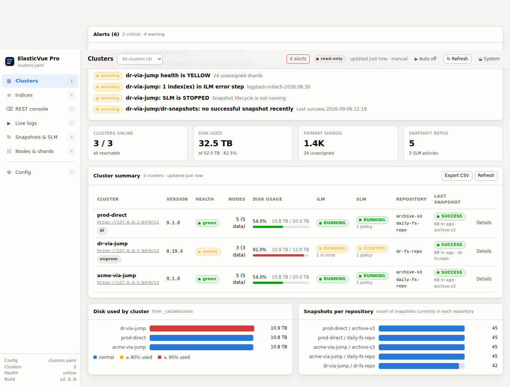
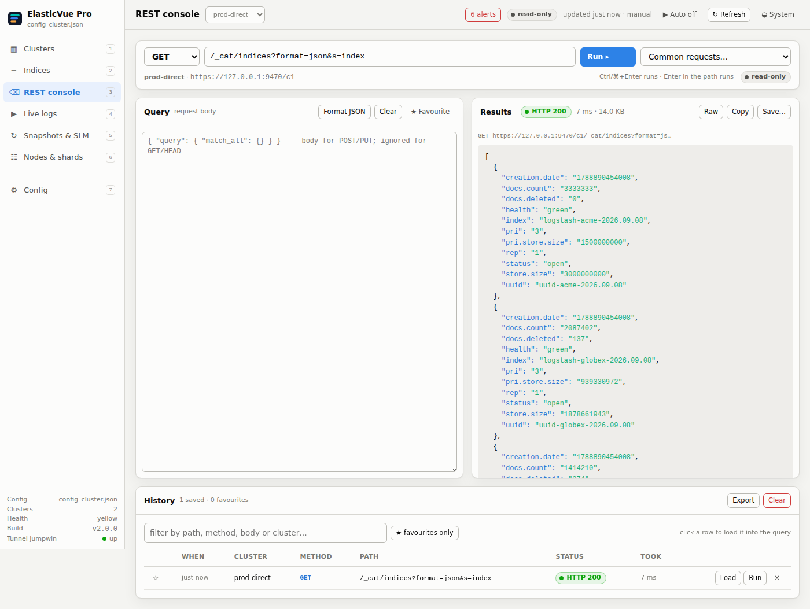
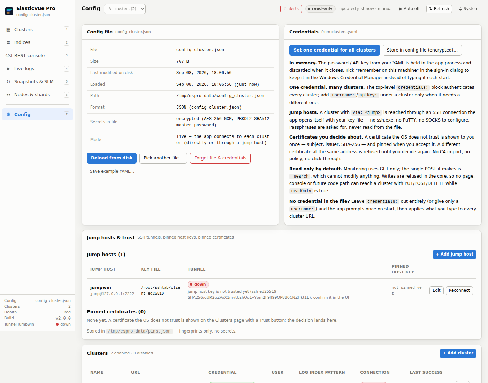

# ElasticVue Pro

**Multi-cluster Elasticsearch dashboard for Windows — reaches clusters behind an SSH jump host, decides certificate trust itself, and never writes to a cluster.**

[](https://github.com/karthick-dkk/elasticvue-pro/actions/workflows/build.yml)
[](https://github.com/karthick-dkk/elasticvue-pro/actions/workflows/ci.yml)


A portable desktop app (Tauri 2 + a small Rust core, vanilla-JS UI, no Node.js) that shows
the health, disk, repositories, ILM/SLM state, last snapshot and daily indices of many
Elasticsearch clusters on one screen — including clusters that are only reachable through a
jump host. Read-only towards Elasticsearch by design.

<p align="center"></p>

## Why this exists

Browser tools cannot do three things an operator behind a jump host needs:

| Problem | What ElasticVue Pro does |
|---|---|
| The cluster is only reachable via a jump host | Opens its **own SSH connection** with your key file (`via: jumpwin`) — no ssh.exe, PuTTY or SOCKS setup. Host keys are confirmed once and pinned; the tunnel reconnects by itself. |
| Self-signed / internal-CA certificates | Shows the certificate once (subject, issuer, validity, SHA-256) with a **Trust** button, then pins it. A different certificate at the same address is refused. No CA import, no browser policy. |
| "Failed to fetch" | Every failure is named — refused, DNS, timeout, TLS untrusted, pin mismatch, jump host down — with a one-line next step and, where a decision is needed, the button to take it. |

## Features

- **Clusters** — health, nodes, disk usage, ILM/SLM status, repositories, last snapshot; search by name, URL, tag, jump host, version or repository, and sort by health, disk, shards, version, last snapshot or open alerts
- **Alerts** — every problem across the fleet on one page, filtered by level and cluster, each row linking to the page that answers it; the count sits on the nav tab
- **Indices** — daily `logstash-<client>-YYYY.MM.DD` indices with a client / date picker, sizes, health; open, close, delete, move a shard between nodes, change replicas and run maintenance, one index or a ticked selection at a time
- **REST console** — every method (GET/HEAD/POST/PUT/PATCH/DELETE), request bar, **Query | Results** side by side, history with favourites, and ~60 grouped ready-made requests (ILM policies, disk watermarks, replica and shard counts, snapshots, diagnostics)
- **Live logs** — tail a day's index with a time histogram
- **Snapshots & SLM** — the latest 5 snapshots per repository (widened on demand), availability of logstash days, policies and last run; create and delete snapshots, restore with index selection and renaming, free the live indices a snapshot already holds, and add, verify, clean up or remove repositories
- **Nodes & shards** — heap, CPU, disk per node; unassigned / initializing shards
- **Config in the UI** — add clusters, jump hosts, the shared credential and defaults; saved as `config_cluster.json`
- **Security** — read-only guard in the core: a write needs both a session unlock *and* a request the operator asked for by hand, so nothing that refreshes on a timer can write; secrets in the file encrypted (AES-256-GCM, PBKDF2-SHA512 master password); optional Windows Credential Manager; TLS pinning; SSH host-key pinning
- **Portable** — one folder, no installer, no admin rights; runs on the analyst PC and on the jump server itself
- **Snapshot mode** — render everything from a JSON file collected elsewhere (esfleet / PowerShell collector) with no network access

<p align="center"></p>

## Quick start (Windows, portable)

1. Download `ElasticVue-Pro-<version>-portable-win64.zip` from [Releases](../../releases) and unzip it anywhere (e.g. `C:\Tools\ElasticVuePro\`) — or take `elasticvue-pro-<version>.exe` straight from this repository. Keep the exe and `WebView2Loader.dll` together.
2. **Windows Server 2016 only:** the app needs the Microsoft WebView2 runtime, which Server 2016 does not ship. No install is required — unpack Microsoft's *Fixed Version Runtime* into the `WebView2Runtime\` folder next to the exe (see [docs/HANDBOOK.md → Portable mode](docs/HANDBOOK.md#portable-mode-no-install-at-all)). Windows 10/11 and Server 2019+ already have it.
3. Run `elasticvue-pro-<version>.exe`. The binaries are not code-signed: on first run SmartScreen may ask — *More info → Run anyway*.
4. **+ Create new config**, add your first cluster, and (for on-prem clusters) a jump host with your SSH key. Confirm the jump host's key fingerprint once, trust each self-signed certificate once.

Everything the app stores stays in `data\` next to the exe (`portable` marker file): `config_cluster.json`, `pins.json` (fingerprints only), the WebView profile.

## Configuration

Created and edited in the app (Config page), or hand-written. JSON is what the app writes; YAML from the browser-extension era is accepted as input.

```json
{
  "version": 2,
  "credentials": { "username": "elastic", "password": "enc:v1:pbkdf2-sha512:600000:<salt>:<nonce>:<ciphertext>" },
  "defaults": { "readOnly": true, "autoRefresh": false, "logIndexPattern": "logstash-*", "tls": "auto" },
  "jump_hosts": {
    "jumpwin": { "host": "jump-windows.internal", "port": 22, "user": "esfleet", "keyFile": "C:\\Users\\me\\.ssh\\id_ed25519" }
  },
  "clusters": [
    { "name": "acme-onprem", "url": "https://172.23.40.118:9200", "via": "jumpwin", "tags": ["onprem"] },
    { "name": "prod-elk",    "url": "https://es-prod-01.internal:9200" },
    { "name": "lab",         "url": "http://192.168.10.25:9200", "tls": "insecure" }
  ]
}
```

| Key | Meaning |
|---|---|
| `credentials` | one credential for every cluster; omit it and the app asks once on start. Per-cluster `username`/`password` override it |
| `password` / `apiKey` / `bearer` | plain, or `enc:v1:…` as written by the app (encrypted with your master password — a hash could not log in) |
| `jump_hosts.<id>` | SSH host, port, user, `keyFile` (OpenSSH format; passphrase is asked in the app, never stored) |
| `clusters[].via` | route through that jump host; the hostname is resolved **on the jump host** |
| `clusters[].tls` / `defaults.tls` | `auto` (OS store, else ask & pin — default), `system` (strict), `insecure` (lab only) |
| `defaults.readOnly` | `true` (default) — the core sends only GET/HEAD and `_search`-family POSTs. A write still gets out if you tick *Allow writes* for the session *and* it is an action you took by hand; `false` allows writes from anywhere |

Command line: `elasticvue-pro-<version>.exe --config C:\path\config_cluster.json` (or `ELASTICVUE_CONFIG`) pre-provisions the file, handy on a jump server.

<p align="center"></p>

## Building

No Node.js anywhere: the UI is plain ES modules, the CLI is Rust.

**On Windows** — Rust (MSVC) + Visual Studio Build Tools (C++ workload):

```powershell
cargo install tauri-cli --version "^2" --locked
cargo tauri build
# target\release\elasticvue-pro.exe                          portable
# target\release\bundle\nsis\ElasticVue Pro_<ver>_x64-setup.exe   per-user installer
```

**From Linux, without any Microsoft toolchain** — this is how the release zips are made:

```bash
tools/build-windows-cross.sh            # mingw-w64, x86_64-pc-windows-gnu, std from source; idempotent
# dist/ElasticVue-Pro-<ver>-portable-win64.zip

tools/build-windows-cross.sh --install  # …and refresh the build committed at the repo root
```

Runs on Linux (apt) and macOS (brew). The exe carries its version in the name
(`elasticvue-pro-<version>.exe`), so which build a machine runs is answerable by looking at
it; `--install` moves the build it replaces into [previous-releases/](previous-releases/)
rather than overwriting it.


**Run the UI in a browser** (development, tests):

```bash
cargo run -p espro-core --features bridge --bin espro-bridge -- ui 8765   # http://127.0.0.1:8765/
cargo test -p espro-core --features bridge     # unit + integration (real sockets, real TLS)
cargo clippy -p espro-core --features bridge --all-targets
node tools/check-ui.mjs                        # the UI has no bundler: parse + resolve imports
npm i jsdom && node tools/render-check.mjs     # render every page against a running bridge
```

This works on macOS and Linux as well as Windows — the core, its tests and the whole UI run
anywhere; only the Tauri shell and the packaging are Windows-specific.

`lab/README.md` shows how to stand up a mock 80-cluster fleet and a restricted local `sshd`
to exercise the jump-host path end to end.

## How it is built

```
crates/espro-core/   Rust core — everything with a security consequence
  guard.rs           read-only guard: GET/HEAD + search-family POST, checked before any socket;
                     writes need both the session unlock and a per-request flag
ui/js/core/writes.js the UI's single copy of that unlock, shared by every acting page
  tls.rs             OS trust store → trust-on-first-use pin (SHA-256 per host:port); SSH host-key pins
  ssh.rs             SSH client (russh): key/passphrase/password auth, TOFU host keys, reconnect with back-off
  socks.rs           in-process SOCKS5 on 127.0.0.1 → direct-tcpip channels on the jump host
  http.rs            one HTTP client per cluster (reqwest/rustls), exact error classification
  crypto.rs          AES-256-GCM + PBKDF2-HMAC-SHA512 for secrets in the config file
  vault.rs           OS credential store (Windows Credential Manager) — opt-in
  bridge.rs          the JSON message API the UI talks to
src-tauri/           Tauri 2 shell: one `bridge` command, native dialogs, portable-mode setup
ui/                  the app UI: vanilla ES modules, no bundler
tools/               cross-build script, portable README
docs/                HANDBOOK.md (full operator manual), screenshots
```

The UI never talks to the network. Every request goes through the core, which owns the
read-only guard, the TLS decisions and the tunnels — so no page, console or future code path
can route around them. The write unlock is no exception: it lives in the core, is never
written to disk, and grants nothing on its own — a request must *also* be marked as one the
operator asked for, which only a click does. An automatic refresh cannot write even while
the session is unlocked.

## Security

See [SECURITY.md](SECURITY.md). Short version: read-only towards Elasticsearch, credentials
never in plain text on disk, TLS and SSH host keys pinned on explicit consent, loopback-only
listeners, unsigned binaries (verify `SHA256SUMS.txt` or build from source).

## Downloads

Every [release](../../releases) carries a package per platform, built by CI on that platform.

| Platform | Package | Notes |
|---|---|---|
| **Windows** x64 | `ElasticVue-Pro-<ver>-portable-win64.zip` | **Recommended.** One folder, no installer, no admin rights. Unzip and run. |
| **Windows** x64 | `ElasticVue Pro_<ver>_x64-setup.exe` | NSIS installer, per-user; embeds the WebView2 bootstrapper. |
| **macOS** Apple Silicon | `ElasticVue Pro_<ver>_aarch64.dmg` | macOS 10.15+. Unsigned — see below. |
| **macOS** Intel | `ElasticVue Pro_<ver>_x64.dmg` | macOS 10.15+. Unsigned — see below. |
| **Linux** x64 | `elasticvue-pro_<ver>_amd64.AppImage` | Self-contained; `chmod +x` and run. |
| **Linux** x64 | `elasticvue-pro_<ver>_amd64.deb` | Debian/Ubuntu. Needs `libwebkit2gtk-4.1-0`, `libgtk-3-0`. |
| **Linux** x64 | `elasticvue-pro-<ver>-1.x86_64.rpm` | Fedora/RHEL. |

The current Windows portable build is also committed at the repo root —
`elasticvue-pro-<version>.exe` next to `WebView2Loader.dll`, with `SHA256SUMS.txt` covering
the pair — so it can be used straight from a clone. Superseded builds move to
[previous-releases/](previous-releases/) with their checksums, so a machine can be rolled back
to a binary that is known to have worked.

**None of the binaries are code-signed.** Windows SmartScreen: *More info → Run anyway*.
macOS Gatekeeper refuses an unsigned, un-notarised app outright — right-click → *Open*, or
`xattr -dr com.apple.quarantine "/Applications/ElasticVue Pro.app"`. Verify checksums or build
from source if that matters to you.

### What differs by platform

The Rust core, the read-only guard, the TLS and SSH host-key pinning and the whole UI are the
same everywhere. Three things are not:

| | Windows | macOS | Linux |
|---|---|---|---|
| Web view | WebView2 (Edge) | WKWebView | WebKitGTK |
| Portable mode (`portable` marker, `data\` beside the exe) | yes | no — use the app bundle | no — use the AppImage |
| Optional OS credential store | Credential Manager | Keychain | kernel keyring — **login session only** |

Windows is the platform the app is deployed and documented for; macOS and Linux builds exist
so the app can be run and developed anywhere, and are less exercised in the field.

## Documentation

- [docs/HANDBOOK.md](docs/HANDBOOK.md) — full operator manual: portable mode, configuration reference, build routes, deployment, what was verified
- [lab/README.md](lab/README.md) — local test bench (mock fleet + restricted sshd)
- [CHANGELOG.md](CHANGELOG.md)

## Contributing

Issues and pull requests are welcome. Keep the invariants: no network access from `ui/`, no
new HTTP call site outside `http.rs`, no write that skips `guard.rs`, no secret written to disk
unencrypted, scripts idempotent. Before opening a PR run what CI runs:

```bash
cargo test -p espro-core --features bridge
cargo clippy -p espro-core --features bridge --all-targets
node tools/check-ui.mjs
```

`tools/render-check.mjs` (needs `npm i jsdom` and a running `espro-bridge`) draws every page
and fails on the first exception — the static check cannot see a call to something that was
never imported, and a blank page is the usual symptom.

## License

[MIT](LICENSE)
